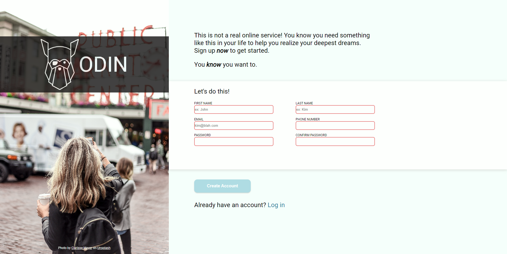

# sign-up-form

ULR: https://yongki95.github.io/sign-up-form/

### Used Skills
1.HTML
2.CSS

### Future work

1. Implemenet code that compare password input and confirm password input.

2. Add phone number validation with pattern.

3. Set min size of section.
### picture Author

Photo by Clarisse Meyer

website: Unsplash

